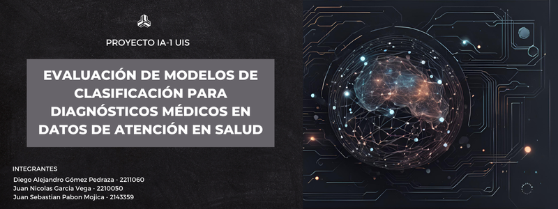

# Proyecto Final IA-1 UIS

Autores: Diego Alejandro Gómez Pedraza (2211060), Juan Nicolas Garcia Vega (2210050), Juan Sebastian Pabon Mojica (2143359)

Objetivo: Evaluar y comparar el rendimiento de modelos de clasificación para diagnósticos médicos en datos de atención en salud.

Dataset: [Descargar aquí](enlace-al-dataset)

Modelos: DecisionTreeClassifier, RandomForestClassifier, SVC, Red Neuronal Artificial (10, 20, 30 epochs)

Enlaces:
- Código: [Repositorio del código](https://github.com/DiegoGomez21/proyecto_IA_atenciones_medicas)
- Video: [Enlace al video de demostración](enlace-al-video)
- Repositorio: [Repositorio principal](https://github.com/DiegoGomez21/proyecto_IA_atenciones_medicas)

